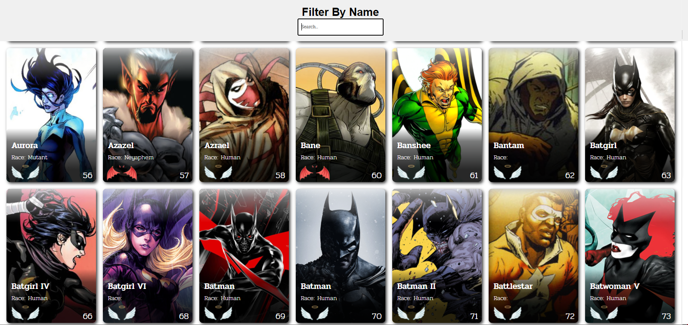
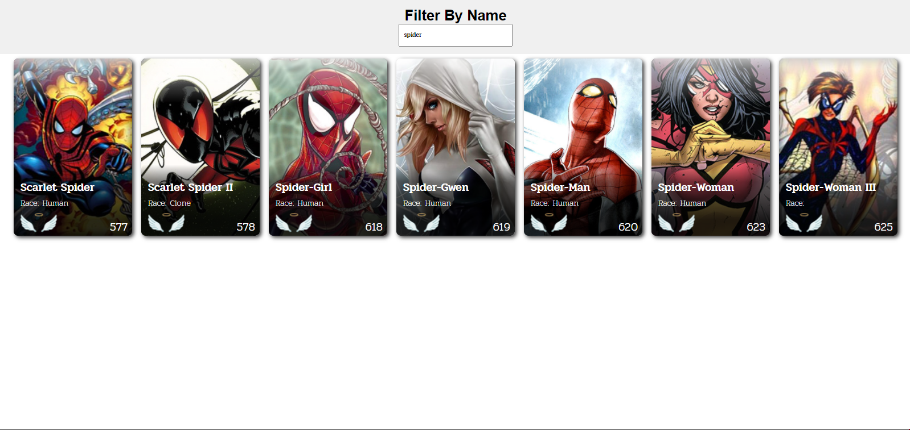
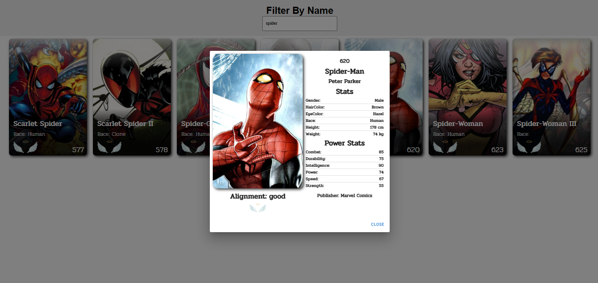

<h1 align="center">
	# azapfy-heros
</h1>

# About the project
O projeto consiste na manipulação da Api: http://homologacao3.azapfy.com.br/api/ps/metahumans, disponibilizado pela azapfy, que retorna dados de vários personagens. O projeto contém cards desses personagens, um input de filtragem dos personagens e um modal com mais informações ao selecionar o personagem. 

# Technologies
- ReactJs in function
- React Router DOM
- Axios

#


<h1 align="center">
	
</h1>
<h1 align="center">
	
</h1>
<h1 align="center">
	
</h1>


Requirements
- npm
- yarn

**Clone the project and access the folder**

```bash
git clone https://github.com/DouglasANS/azapfy-heros.git 
```
&&
```bash
cd azapfy-heros
```

**Follow the steps below**

```bash
# Install the dependencies
$ npm install or yarn install

# To finish, run the application
$ npm start or yarn start

# Well done, project is started!
```
